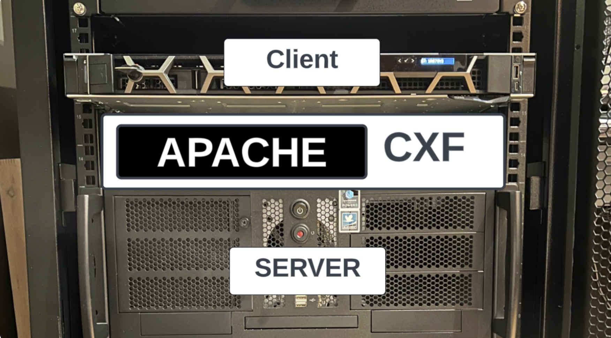
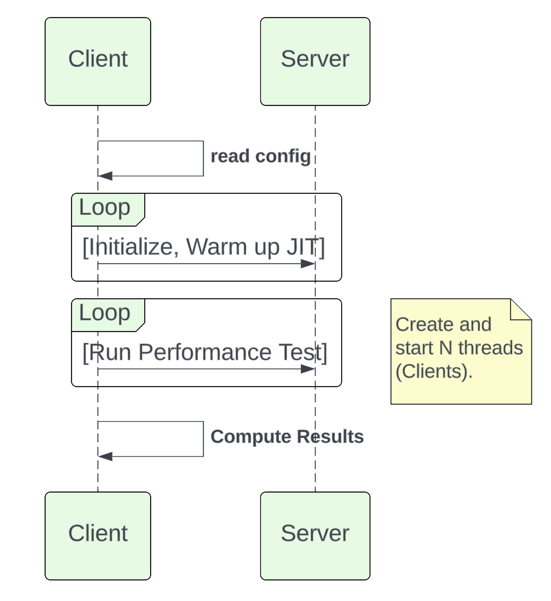
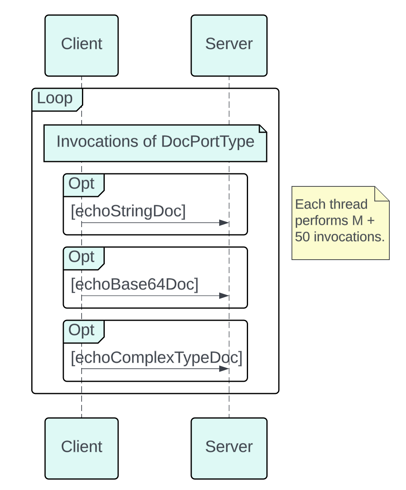

# Apache CXF SOAP Performance

You know what would be fun? Attempting to run 1 Billion soap invocations
through CXF in 8 hours!

# The Setup

<figure>

</figure>

For our lab test we’ll be using the following hardware:

- Dell PowerEdge R250 (Client Host)

  - Intel Xeon E-2378 (8c, 16t)

  - 128 GB DDR4 RAM

  - 1 Gigabit Ethernet

- Raptor Blackbird (Server Host)

  - IBM POWER9 v2 SMT4 Sforza (8c, 32 t)

  - 128 GB DDR4 RAM

  - 1 Gigabit Ethernet

The machines are co-located on the same switch, reducing the number of
packet hops.

# The Performance Harness

As of CXF 4.1 the binary distribution will contain a set of performance
scripts in the samples folder. Options to test JAX-WS and JAX-RS are
present.

<figure>

</figure>

At its core, the performance harness is a client-server request/response
automation. On startup the script initializes and warms up the JVM for
executing mass calls.

## How it works

The client host runs a number of threads, each running a CXF client
which invokes up the server host. For JAX-WS testing, we have a choice
of invoking on DocPortType as String, Base64, or as a ComplexType. The
client side harness will run N threads for M invocations for a duration
of time.

<figure>

</figure>

Once the time duration has been met, it will cease the executing
clients, and tabulate the total invocations.

# Theory Time!

Given our goal of achieving 1 Billion invocations in an eight hour
period, lets take a look at what velocity our clients will need to
maintain to collectively reach our goal line. Before setting up a full
testing run, we run a 60 second quick test to see what throughput we
might expect to see on our lab hardware.

| Clients | Target Invocations/Second per client | Quick Test (Reality) per client |
|----|----|----|
| 1 | 34722.2 | 1486.87 |
| 8 | 4340.27 | 1429.85 |
| 16 | 2170.14 | 1153.35 |
| 32 | 1085.07 | 911.17 |
| 64 | 542.53 | 523.5 |
| 100 | 347.2 | 347.6 |
| 128 | 271.27 | 269.02 |

As the above table illustrates, we either need to have each client
running at a high velocity OR run many clients at a lower velocity to
reach our goal line.

Its clear that a single threaded client is not going to achieve our
throughput.

Its also clear that as the number of threads increase, the throughput
per thread decreases on this system.

The trend line suggests that a setting nearing 100 would be our best bet
for extended testing.

# Lets get this test case running

To run the performance harness we change directory into samples. Within
this folder we’ll build the base harness and the various scenarios.

On each host we will open a terminal to the CXF distribution samples
folder.

We’ll ensure we have JAVA_HOME and MAVEN_HOME environment variables set.

For our first run we’ll use Adoptium Eclipse Temurin 17 LTS as Client
and Server side JVM.

We set our Heap size to 8GB.

``` bash
MAVEN_OPTS="-Xms32m -Xmx8192m -Dmaven.artifact.threads=5"
```

``` bash
$ cd samples
$ mvn clean install
$ cd performance/soap_http_doc_lit
```

On the Server host we’ll execute the following maven profile:

``` bash
$mvn -Pserver -Dhost=0.0.0.0 -Dprotocol=http
```

On the Client host we’ll execute the client profile, supplying
instructions to use HTTP protocol, echoComplexTypeDoc operation, use 100
threads (simulate 100 clients), over a time of 8 hours (60 x 60 x 8 =
28800 seconds).

``` bash
$mvn -Pclient -Dhost=192.168.50.154 -Dprotocol=http -Doperation=echoComplexTypeDoc -Dthreads=100 -Dtime=28800
```

For the purposes of our lab test, we’ll allow the suite to execute
without added agents to the JVM.

# LAB TIME!

## *First Run*

Our first iteration of this test resulted in 953,428,857 invocations in
8 hours…​ 47 Million less than our goal of 1 Billion.

``` bash
=============Overall Test Result============
Overall Throughput: echoComplexTypeDoc 331.05150369031566 (invocations/sec)
Overall AVG. response time: 3.0206780179299737 (ms)
9.53428857E8 (invocations), running 2880001.5900000003 (sec)
============================================
```

## *Second Run*

On our second run we re-configure our JAVA_HOME to use Adoptium Eclipse
Temurin 21 LTS and pass in the following arguments to the JVMs:

``` bash
$mvn -Pserver -Dhost=0.0.0.0 -Dprotocol=http
```

``` bash
$mvn -Pclient -Dhost=192.168.50.154 -Dprotocol=http -Doperation=echoComplexTypeDoc -Dthreads=100 -Dtime=28800
```

This resulted in:

``` bash
=============Overall Test Result============
Overall Throughput: echoComplexTypeDoc 320.70739201496815 (invocations/sec)
Overall AVG. response time: 3.118107112271761 (ms)
9.23639228E8 (invocations), running 2880006.0459999987 (sec)
============================================
```

## *Third Run*

The first two test iterations used default CXF and JVM properties. On
our third run lets pass in a simple CXF configuration to Client and
Server JVMs to instruct them enable HTTP2 & AsyncHTTPConduit.

client.xml

``` xml
<beans xmlns="http://www.springframework.org/schema/beans"
    xmlns:cxf="http://cxf.apache.org/core"
    xmlns:xsi="http://www.w3.org/2001/XMLSchema-instance"
    xsi:schemaLocation="http://cxf.apache.org/core
    http://cxf.apache.org/schemas/core.xsd
    http://www.springframework.org/schema/beans
    http://www.springframework.org/schema/beans/spring-beans.xsd">

    <cxf:bus>
        <cxf:properties>
            <entry key="use.async.http.conduit" value="true"/>
            <entry key="org.apache.cxf.transports.http2.enabled" value="true"/>
        </cxf:properties>
    </cxf:bus>

</beans>
```

server.xml

``` xml
<beans xmlns="http://www.springframework.org/schema/beans"
    xmlns:cxf="http://cxf.apache.org/core"
    xmlns:xsi="http://www.w3.org/2001/XMLSchema-instance"
    xsi:schemaLocation="http://cxf.apache.org/core
    http://cxf.apache.org/schemas/core.xsd
    http://www.springframework.org/schema/beans
    http://www.springframework.org/schema/beans/spring-beans.xsd">

    <cxf:bus>
        <cxf:properties>
            <entry key="use.async.http.conduit" value="true"/>
            <entry key="org.apache.cxf.transports.http2.enabled" value="true"/>
        </cxf:properties>
    </cxf:bus>

</beans>
```

Before we can execute this iteration, we’ll need to update the pom.xml
to include a few more dependencies:

``` xml
<dependency>
    <groupId>org.apache.cxf</groupId>
    <artifactId>cxf-rt-transports-http-jetty</artifactId>
    <version>${project.version}</version>
</dependency>
<dependency>
    <groupId>org.springframework</groupId>
    <artifactId>spring-beans</artifactId>
    <version>6.1.11</version>
</dependency>
<dependency>
    <groupId>org.springframework</groupId>
    <artifactId>spring-context</artifactId>
    <version>6.1.11</version>
</dependency>
<dependency>
    <groupId>org.eclipse.jetty.http2</groupId>
    <artifactId>jetty-http2-server</artifactId>
    <version>${cxf.jetty12.version}</version>
</dependency>
```

Reusing Adoptium Eclipse Temurin 21 LTS, we pass the following arguments
to the JVMs:

``` bash
$mvn -Pserver -Dhost=0.0.0.0 -Dprotocol=http -Dcfg=client.xml
```

``` bash
$mvn -Pclient -Dhost=192.168.50.154 -Dprotocol=http -Doperation=echoComplexTypeDoc -Dthreads=100 -Dtime=28800 -Dcfg=server.xml
```

When the server side starts up, we’ll observe h2c in the logging.

``` bash
INFO: Started ServerConnector@9f73b40{HTTP/1.1, (http/1.1, h2c)}{localhost:8080}
```

This resulted in:

``` bash
=============Overall Test Result============
Overall Throughput: echoComplexTypeDoc 320.834130463552 (invocations/sec)
Overall AVG. response time: 3.116875372813878 (ms)
9.24006644E8 (invocations), running 2880013.553 (sec)
============================================
```

## *Fourth Run*

We do not appear to be achieving the theoretical velocity our quick
tests suggested, lets see if GC is our bottleneck.

For this run we return to Java 17, and switch our Client Xmx setting to
100GB. The extra heap space may help reduce runtime GC.

``` bash
MAVEN_OPTS="-Xms32m -Xmx102400m -Dmaven.artifact.threads=5"
```

``` bash
$mvn -Pserver -Dhost=0.0.0.0 -Dprotocol=http
```

``` bash
$mvn mvn -Pclient -Dhost=192.168.50.154 -Dprotocol=http -Doperation=echoComplexTypeDoc -Dthreads=100 -Dtime=28800
```

This resulted in:

``` bash
=============Overall Test Result============
Overall Throughput: echoComplexTypeDoc 334.5341555307743 (invocations/sec)
Overall AVG. response time: 2.9892313937672315 (ms)
9.63461638E8 (invocations), running 2880009.7749999994 (sec)
============================================
```

## *Fifth Run*

Time for more JVM tuning. This time we’ll reduce memory resizing by
equalizing XMS and XMX settings, and relax G1GC soft limits. These
settings will be placed on Client and Server side.

``` bash
MAVEN_OPTS="-Xms102400m -Xmx102400m -Dmaven.artifact.threads=5 -XX:MaxGCPauseMillis=400 -XX:+ParallelRefProcEnabled"
```

``` bash
$mvn -Pserver -Dhost=0.0.0.0 -Dprotocol=http
```

``` bash
$mvn mvn -Pclient -Dhost=192.168.50.154 -Dprotocol=http -Doperation=echoComplexTypeDoc -Dthreads=100 -Dtime=28800
```

This resulted in:

``` bash
=============Overall Test Result============
Overall Throughput: echoComplexTypeDoc 345.9386518961459 (invocations/sec)
Overall AVG. response time: 2.890685948270994 (ms)
9.96304924E8 (invocations), running 2880004.644000001 (sec)
============================================
```

## *Sixth Run*

Extend GC timing by 100ms.

``` bash
MAVEN_OPTS="-Xms102400m -Xmx102400m -Dmaven.artifact.threads=5 -XX:MaxGCPauseMillis=500 -XX:+ParallelRefProcEnabled"
```

``` bash
$mvn -Pserver -Dhost=0.0.0.0 -Dprotocol=http
```

``` bash
$mvn mvn -Pclient -Dhost=192.168.50.154 -Dprotocol=http -Doperation=echoComplexTypeDoc -Dthreads=100 -Dtime=28800
```

This resulted in:

``` bash
=============Overall Test Result============
Overall Throughput: echoComplexTypeDoc 346.62366823033824 (invocations/sec)
Overall AVG. response time: 2.884973219242145 (ms)
9.98279255E8 (invocations), running 2880008.9159999997 (sec)
============================================
```

# Results and Conclusion

Lets recap:

Our aim is to meet or exceed 347.2 invocations per second on average
over a time of 8 hours. Each of our test iterations are summarized
below.

| Iteration | JVM | Throughput (invocations/sec) | Total Invocations in 8 Hours | Notes |
|----|----|----|----|----|
| 1 | Adoptium 17 | 331.0 | 953,428,857 | Default Bus, Client & Server 8GB heap. |
| 2 | Adoptium 21 | 320.7 | 923,639,228 | Default Bus, Client & Server 8GB heap. |
| 3 | Adoptium 21 | 320.8 | 924,006,644 | HTTP2 enabled, Client & Server 8GB heap. |
| 4 | Adoptium 17 | 334.5 | 963,461,638 | Default Bus, Client 100GB heap, Server 8GB heap. |
| 5 | Adoptium 17 | 345.9 | 996,304,924 | Default Bus, Client and Server side JVM tuning. |
| 6 | Adoptium 17 | 346.6 | 998,279,255 | 100ms more lax GC than run 5. |

Our calculations suggested that 100 client threads could achieve 1
Billion invocations in 8 hours on our lab hardware. Testing data however
shows that over time our initial rates slow down, missing our objective
by 5 to 8%. Surprisingly, Java 21 fared poorer than Java 17 runs.

When we began providing additional heap space to Client & Server,
relaxing Max GC pause times, our throughput improved.

# About the Authors

[Jamie
Goodyear](https://github.com/savoirtech/blogs/blob/main/authors/JamieGoodyear.md)

# Reaching Out

Please do not hesitate to reach out with questions and comments, here on
the Blog, or through the Savoir Technologies website at
<https://www.savoirtech.com>.

# With Thanks

Thank you to the Apache CXF community.

\(c\) 2024 Savoir Technologies
